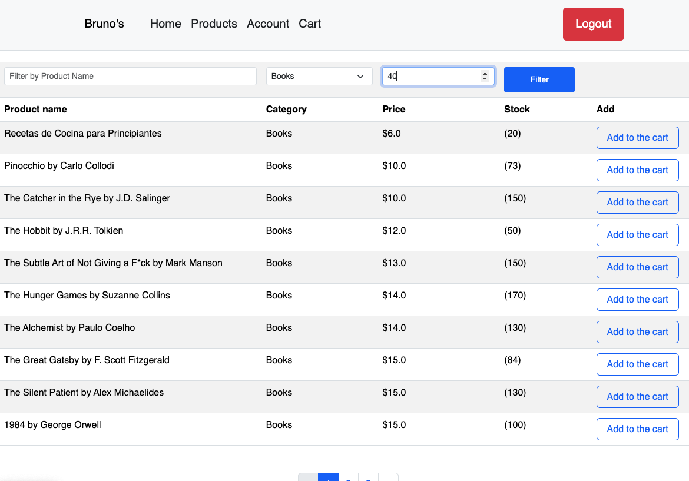

# Store App

## Table of Contents
- [General Info](#general-info)
- [Technologies Used](#technologies-used)
- [Features](#features)
- [Screenshots](#screenshots)
- [Room for Improvement](#room-for-improvement)

## General Info
Store App is a web application built with Spring Boot. The project is currently running locally and provides a CRUD system to manage users with different roles: `ADMIN`, `CUSTOMER`, and `DEVELOPER`.

### User Roles:
- **CUSTOMER**: Can view the product list, add items to the cart, and process orders. Also has permissions to manage their profile and view order history.
- **ADMIN**: Can create, edit, and delete products but cannot add products to the cart or have accounts with balances.
- **DEVELOPER**: Has access to all the features of both ADMIN and CUSTOMER roles for testing purposes.

The application is backed by a MySQL database with the following entities:
- `users`
- `orders`
- `order_details`
- `products`
- `categories`
- `accounts`
- `roles`
- `permissions`
- `role_permissions`
- `user_roles`

### Relationships:
- `orders` (many-to-one) `user`
- `order_details` (many-to-one) `order`, (one-to-one) `product`
- `accounts` (many-to-one) `user`
- `users` (many-to-many) `roles`
- `user_roles` (intermediate table for `users` and `roles`)
- `roles` (many-to-many) `permissions`
- `role_permissions` (intermediate table for `roles` and `permissions`)
- `products` (many-to-one) `category`

## Technologies Used
- **Spring Boot** - Framework for building the web application
- **MySQL** - Database for persisting user data, orders, products, and more
- **Spring Data JPA** - For handling database operations with repositories
- **Spring Security** - For user authentication and access control
- **Thymeleaf** - For rendering dynamic web pages
- **Spring Data Specifications** - For implementing product search filters
- **HTML, CSS, JavaScript** - For frontend development and user interface
- **Spring Boot Starter Web** - For creating REST APIs and serving the web pages
- **Firebase** - Used for storing profile images, with only the URL being stored in the SQL database

## Features
- **User Role Management**: `ADMIN`, `CUSTOMER`, and `DEVELOPER` roles with varying levels of access.
- **Product Management**: Customers can view products, add them to their cart, and process orders.
- **Order Management**: Customers can view their order history and order details.
- **Authentication**: User authentication via Spring Security.
- **Search Filters**: Implemented search filters for products using Spring Data Specifications.
- **Pagination**: Pagination of product list for efficient browsing.
- **Cart Management**: Customers can add products to their cart, and it is stored in the session until the order is processed.
- **User Management**: Developers and admins can now create, edit, deactivate, and reactivate users.

## Screenshots

## Room for Improvement
- **Account Balance Refill**: A feature to refill account balances is missing.
- **Password Reset**: There is no password reset functionality yet.
- **Account Creation**: The ability for customers to create new accounts is not yet implemented.
- **User Profile Editing**: Users still cannot update their own profiles.

### Future Improvements:
- **Delete Product Handling**: The delete functionality for products should be modified. Deleting a product used in an order causes an SQL constraint violation. A boolean flag (e.g., `active`) will be added to products to mark them as deactivated instead of deleting them outright.
- **REST APIs**: The current controllers should be refactored into REST APIs to allow the frontend to consume data more efficiently, making the application more scalable.
